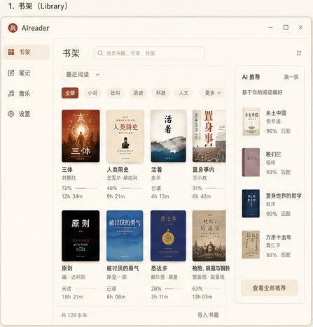
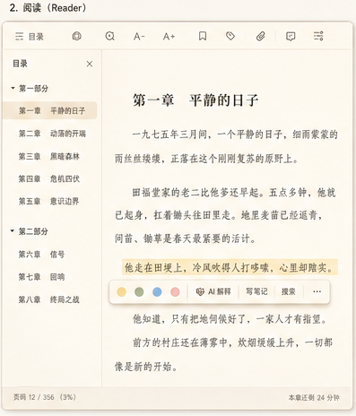
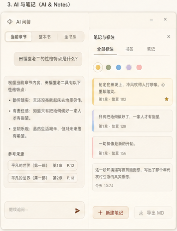
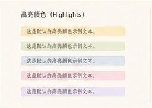
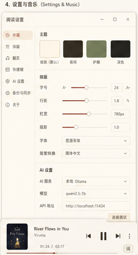

> 我做 AI reader，不是为了让 AI 替我读书。
>
> 恰恰相反，我希望它能让我更愿意回到书里。

一直以来，我都觉得电子阅读器少了一点东西。

它们可以打开书，可以翻页，可以划线，可以做笔记。但当我真的沉浸在一本书里时，常常会遇到一些更细碎的问题：

这个人物之前出现过吗？

这段话背后的历史背景是什么？

这一章到底在推进什么？

我划过的这些句子，最后能不能整理成一份真正属于自己的读书笔记？

如果我的书架里有几百本书，我能不能直接问它：“我读过哪些书谈到过这个问题？”

这些需求，以前通常要在好几个工具之间来回切换。

于是我用 Vibe Coding 的方式，开发了一个结合 AI 功能的阅读器：**AI reader**。

## 它首先是一个能安静读书的地方

AI reader 是一个本地桌面阅读器，支持 EPUB、PDF、TXT、DOCX、MOBI、AZW、AZW3 等格式。

我做它的第一个原则是：

**阅读本身不能被 AI 打扰。**

所以它保留了一个阅读器该有的基础体验：书架、目录、继续阅读、书签、字号调节、主题切换、划线、高亮、注释、阅读时长统计。

这些功能不是最炫的部分，但它们是地基。

一个 AI 阅读器如果连“舒服地读完一章”都做不好，那 AI 功能再多，也只是贴在外面的装饰。

## 真正想做的，是让 AI 进入阅读现场

AI reader 最核心的部分，是把 AI 放进阅读流程里，而不是把书丢给 AI 让它替我读。

我希望 AI 像一个坐在旁边的读书助手：

我不懂的时候问它。

我需要回顾的时候让它帮我整理。

我想连接不同书之间的概念时，让它帮我从自己的书库里找线索。

目前 AI reader 支持三种 AI 问答模式。

**当前章节问答**

读到某一章时，可以直接问：“这一章主要讲什么？”“这句话是什么意思？”“这个典故有什么背景？”

AI 会基于当前章节回答，不需要先索引整本书。

**整本书问答**

如果想问一本书的整体结构、人物关系、核心观点，就可以对整本书建立本地索引，再进行问答。

**全书库问答**

这是我自己很喜欢的功能。

它可以跨越整个本地书库提问，比如：

“我读过的书里，哪些地方讨论过个人主义？”

“有没有几本书都提到类似的历史事件？”

这让自己的电子书库不再只是一个文件夹，而更像一个可以被查询、被连接的私人知识空间。

## AI 回答必须能回到原文

做 AI 阅读器时，我最在意的一点是：

**AI 不能只给一个看起来很顺的回答。**

所以在整本书和全书库问答里，AI reader 会先检索相关片段，再把片段交给大模型生成回答。

回答中的引用片段可以点击跳回原文。

这件事对阅读很重要。

因为阅读不是单纯要一个结论，而是要能回到文本本身。AI 可以帮我加速理解，但它不能替代我和原文之间的关系。

所以我希望 AI reader 里的 AI 更像“带路”，而不是“代读”。

## 让笔记变成可以继续生长的东西

读书时，我经常会划线，但划线多了以后也会变成另一种负担。

AI reader 支持高亮、注释、跨书搜索标注，也可以把笔记导出成 Markdown。

更进一步，它还能基于我在一本书里的划线和注释，让 AI 帮我整理本书要点和主线。

这个功能的意义不是让 AI 总结一本书，而是让 AI 总结：

**我读这本书时真正注意到的东西。**

普通摘要回答的是：这本书讲了什么。

基于标注的摘要回答的是：我在这本书里看见了什么。

对我来说，后者更接近真正的读书笔记。

## 做 AI reader 时，我对 Vibe Coding 的一点感受

AI reader 也是我用 Vibe Coding 做出来的一个作品。

这个过程里我最大的感受是：Vibe Coding 不是“随便说一句，AI 就把软件做好”，而是把自己脑子里那些模糊的使用感受，一点点说清楚、拆具体，再做出来。

比如我一开始想的并不是“我要做一个 RAG 系统”，而是：

读一本书时，能不能直接问整本书的问题？

AI 回答之后，能不能点回原文？

后来这个想法才变成了本地索引、片段检索和引用跳转。

所以我觉得 Vibe Coding 最适合做那种“自己真的会用”的工具。

因为只有自己在用，才知道哪里别扭，哪里应该安静，哪里需要 AI 出现，哪里又不该打扰阅读。

AI reader 对我来说，不只是一个阅读器，也是一次把自己的阅读习惯慢慢做进软件里的过程。

## AI 也可以帮书架变得更聪明

除了阅读页里的问答，AI reader 还把 AI 用在书架管理上。

比如，它可以给书自动分类。

扫描书库后，AI 会根据书名、作者和相关信息，把书归入文学小说、历史、哲学、科技、经管、心理、艺术、诗歌散文、教材工具书、传记等分类。

它也可以做 AI 推荐：根据阅读记录、分类、内容相似度，推荐下一本可能适合读的书，并给出推荐理由。

这其实是我很想要的能力。

因为电子书越攒越多以后，最大的问题不是“没有书读”，而是“下一本读什么”。

AI reader 想解决的，正是这种私人书库里的选择困难。

## 还有一个有点浪漫的功能：章节配乐

AI reader 还做了一个我自己很喜欢的小功能：根据当前章节推荐背景音乐。

它可以扫描本地音乐库，给音乐打情绪标签，再根据章节内容推荐适合的曲目。

读小说、散文或者历史时，这个功能会让阅读多一点氛围感。

它不是必要功能，但它很符合我对阅读器的想象：

**阅读不只是处理信息，也是一种体验。**

## 本地优先：书和笔记都在自己手里

AI reader 还有一个重要设计：本地优先。

书籍、笔记、阅读进度、聊天记录、音乐索引都保存在本地。

只有当我主动使用 AI 功能时，相关上下文才会发送到我自己配置的大模型接口。

嵌入索引也是本地计算的。也就是说，书库内容不会被拿去上传给某个嵌入服务。

作为一个长期整理电子书和笔记的人，我很在意这一点。

读书数据是很私人的东西，它不只是文件，也包含一个人的兴趣、问题意识和精神路径。

## 为什么要自己做？

因为我想要的不是一个“带 AI 的阅读器”，而是一个“围绕阅读重新设计 AI 功能”的工具。

AI reader 现在还在不断完善中，但它已经越来越接近我想要的样子：

一个安静的本地书架。

一个舒服的阅读界面。

一个能基于原文回答问题的 AI 助手。

一个能整理划线和笔记的读书伙伴。

一个能从我的书库里帮我建立连接的私人知识入口。

我做 AI reader，不是为了让 AI 替我读书。

恰恰相反，我是希望 AI 能让我更愿意回到书里，更容易停留在文本里，也更好地把读过的东西变成自己的东西。

